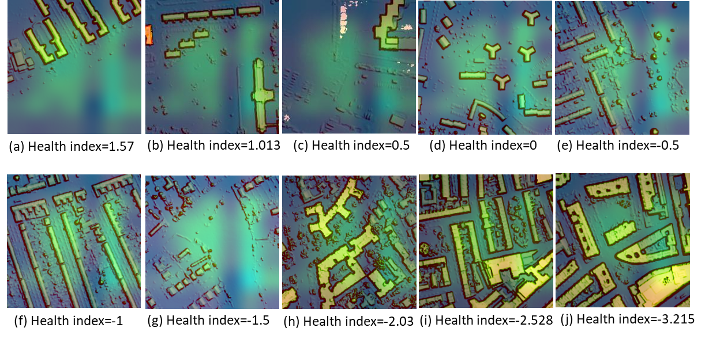

# Analysis of LiDAR Images with the Health Deprivation Index
![alt text] (LIDAR_41456.png)
LiDAR (light detection and ranging) is a modern technique for creating high-resolution ground 
elevation models. It is frequently used in a variety of fields, including geography and forestry. 
The aim of the deprivation index is to characterize and highlight deprivation at the small-area level, 
which is meaningful for regional resource planning in the health and social services system. The 
most frequent used index is multidimensional deprivation index which contains income, work, 
health deprivation and disability, education, crime, impediments to housing and services, and 
living environment. This project examines the relationship between 
LiDAR images and the health deprivation index.

## Prerequisites

Python packages required: pandas, numpy, h5py, sklearn, matplotlib, os, tensorflow

## Steps: 

1. Load data

The LiDAR images are avaiable from [UK's open datasource](https://data.gov.uk/dataset/f0db0249-f17b-4036-9e65-309148c97ce4/national-lidar-programme) for a specific area covering parts of London, UK. Meanwhile, an embedding structural data in a csv form is available which contains the geographic information of each neighbourhood. As for the image data, the format of the images name is "LIDAR"+"ID"+".png", where "ID" refers to the "id" column in the embedding data.

2. Transfer Learning

Transfer learning is a machine learning method that focuses on storing and transferring knowledge 
learned while addressing one problem to a different but related problem, which is commonly used 
in convolutional neural network (CNN) models. Three models were trained and assessed in this study using R2 score and MSE (mean squared error). The first model is a CNN with a VGG16 base model. The second model is a CNN using a ResNet50V2 base model. Only LiDAR imagery is supplied into these two models. A multimodal learning model is the final model. Multimodal learning necessitates the collection of data from a variety of sources. To improve the model's predictive potential, unstructured data such as pthotographs are merged with structured data. The article in this repository has further information about the model architectures and evaluation. 

3. Visualization using Grad-CAM

Gradient-weighted Class Activation Mapping (Grad-CAM) uses the gradients of target flowing 
into the final convolutional layer to produce a coarse localization map highlighting the important 
regions in the image. Below shows the highlighted areas which are the main features in the second model. 

